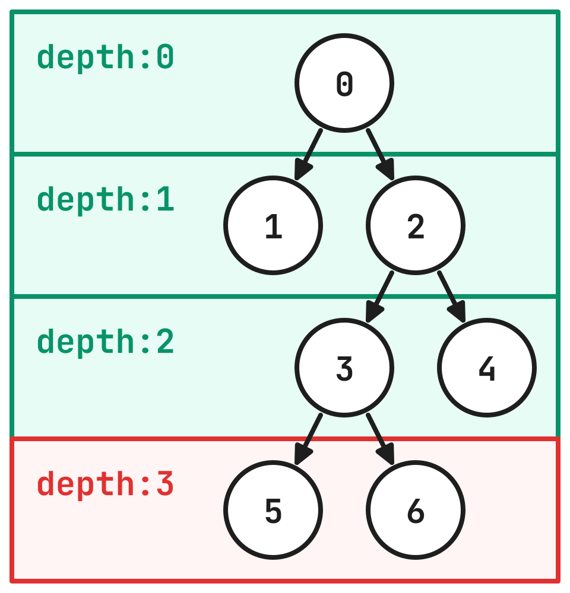

<picture>
    <source media="(prefers-color-scheme: dark)" srcset="./.github/assets/logo_dark.svg">
    
</picture>

# What is graph?

graph is golang package with graph algorithms and data structures.

# What is special?

All algorithms and data structures in this package are based on a simple abstraction that contains only one method:

```go
type Graph[K comparable] interface {
	Adjacency(vertex K) []K
}
```

As you might have guessed, this allows us to treat a wide variety of data structures as graphs without extra boilerplate.

# Data structures

There are several graph implementations in this package with unique data storing mechanisms. The most universal are `Mapped` and `Indexed`, that store vertices in map and slice respectively.

But there are also much more specific structures. One of them is `Grid` which is an infinite grid in where each vertex has only four neighbors. Newly created grid takes up almost no space since all neighbors are calculated based on the input vertex, but any modifications to the graph force affected vertices to be stored in memory.

# Showcase

Iterating over tree using BFS:

```go
g := graph.NewIndexed[uint]()
g.AddVertices(7)
g.AddEdges([][2]uint{{0, 1}, {0, 2}, {2, 3}, {2, 4}, {3, 5}, {3, 6}}...)

err := graph.BFS(g, 0, func(vertex, depth uint) bool {
	if depth > 2 {
		return false
	}
	fmt.Printf("%d: depth: %d, neighbors: %v\n", vertex, depth, g.Adjacency(vertex))
	return true
})
```

```
0: depth: 0, neighbors: [1 2]
1: depth: 1, neighbors: []
2: depth: 1, neighbors: [3 4]
3: depth: 2, neighbors: [5 6]
4: depth: 2, neighbors: []
```


